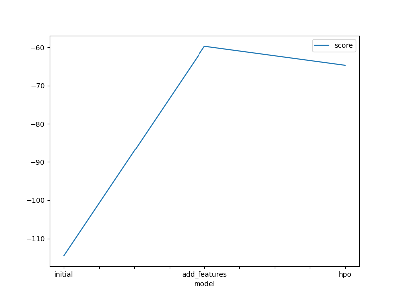
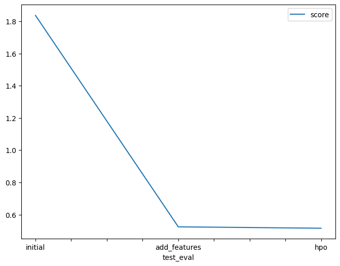

# Report: Predict Bike Sharing Demand with AutoGluon Solution
#### SHANTHINI C

## Initial Training
### What did you realize when you tried to submit your predictions? What changes were needed to the output of the predictor to submit your results?
Initially using the raw dataset without conducting any data analysis or feature engineering led to subpar model performance due to a considerable number of errors. To ensure I could submit my results to Kaggle, I had to replace the negative numbers with zeros.

### What was the top ranked model that performed?
KNeighborsUnif_BAG_L1

## Exploratory data analysis and feature creation
### What did the exploratory analysis find and how did you add additional features?
I enhanced the dataset by extracting additional features from the datetime column, such as month, day, year, and hour. Additionally, I converted the season and weather features into categorical variables, which proved to be beneficial for model training and evaluation.

### How much better did your model perform after adding additional features and why do you think that is?
By incorporating additional features like date separation, the model gains a deeper understanding of the data's temporal patterns, which can significantly improve its predictive accuracy. This is particularly useful in regression tasks where capturing seasonal trends can be crucial for accurate predictions.

## Hyper parameter tuning
### How much better did your model preform after trying different hyper parameters?
Although hyperparameter tuning showed promise in certain scenarios, its overall impact on model performance was not substantial. While some parameter configurations yielded positive results, others had a detrimental effect on the model's predictive accuracy.

### If you were given more time with this dataset, where do you think you would spend more time?
To improve the model's performance, I conducted a thorough data analysis, which included exploratory data exploration, feature engineering, and visualization techniques. Furthermore, I extensively researched hyperparameters to optimize their settings. Although some configurations led to only marginal improvements, the overarching goal was to enhance the model's predictive accuracy through iterative refinement.

### Create a table with the models you ran, the hyperparameters modified, and the kaggle score.
model |	hpo1 |	hpo2 |	hpo3 |	score
initial	| default_vals | default_vals |	default_vals |	1.80056
add_features |	default_vals |	default_vals |	default_vals |	0.51186
hpo | num_leaves: lower=26, upper=66 | dropout_prob: 0.0, 0.5	 | num_boost_round: 100	0.52426

### Create a line plot showing the top model score for the three (or more) training runs during the project.

TODO: Replace the image below with your own.

### Create a line plot showing the top kaggle score for the three (or more) prediction submissions during the project.

TODO: Replace the image below with your own.

## Summary
TODO: Add your explanation
